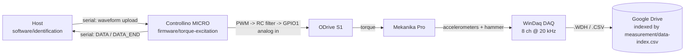

# Architecture

Short overview and pointers. The layout convention itself is specified in
[`doqs/docs/architecture.md`](../doqs/docs/architecture.md) — this file does not restate it.

## What this project is

AQTUATOR is a **product line of linear stages**. Each stage family is a module under
[`modules/`](../modules/). A Mekanika Pro milling machine is the test bench the stages are measured
on.

The first family is
[`modules/flexure-ball-screw-servo-stage/`](../modules/flexure-ball-screw-servo-stage/): a linear
stage that suppresses **chatter** actively, guided by flexures and driven by a ball screw and a
servo motor. The work so far has been to characterise the test machine — measure its
frequency response and stability limits under stepper and servo drives — so that an actuator can be
designed against real numbers rather than assumptions. The campaigns that measured it, the firmware
that excited it and the host software that identified it all sit inside that family, because they
move with it if it ever becomes its own repository.

The second family is [`modules/compact-stage/`](../modules/compact-stage/). Only the module is
reserved so far.

Folder names say what a stage is, not what it is called on a price list. A commercial name belongs
in a family's `catalog.toml` when there is one.

The repository also holds the shared machine-level material: CAD, the models that predict
behaviour, and the written record. Actuator concept
sizing (50 × 50 × 20 mm, 0.1 mm, > 10 Hz) lives in
[`simulation/cases/short-stroke-actuator-concepts`](../simulation/cases/short-stroke-actuator-concepts/).
The 200 N reluctance figure is pole-face Maxwell stress, not packaged continuous force
([Fluxthor catalog check](../simulation/cases/short-stroke-actuator-concepts/README.md#fluxthor-catalog-vs-our-maxwell-number)).

## Module map

| Folder | What |
| --- | --- |
| [`modules/flexure-ball-screw-servo-stage/`](../modules/flexure-ball-screw-servo-stage/) | The chatter-suppression stage family: its measurement campaigns, firmware and host software |
| [`modules/compact-stage/`](../modules/compact-stage/) | The compact stage family. Name reserved, nothing designed yet |
| [`cad/`](../cad/) | FreeCAD models of the machine and the actuator |
| [`architecture/`](../architecture/) | SysML requirements and block definitions |
| [`simulation/`](../simulation/) | Design-time models: structural dynamics, PWM/RC trade-off |
| [`docs/log/`](log/) | Chronological record of the work (activity log) |
| [`docs/decisions/`](decisions/) | Why things are the way they are |
| [`docs/mistakes/`](mistakes/) | What not to repeat |

## The identification signal chain

The central technical arrangement: a torque command generated on the host reaches the ODrive as an
*analog* voltage, because the CAN path could not sustain the required rate.

The paths in the diagram are relative to
[`modules/flexure-ball-screw-servo-stage/`](../modules/flexure-ball-screw-servo-stage/).

Workflow B bypasses the Controllino entirely and captures inside the ODrive over USB at the
control-loop rate.

Details live with the code they describe:
[`modules/flexure-ball-screw-servo-stage/firmware/torque-excitation/README.md`](../modules/flexure-ball-screw-servo-stage/firmware/torque-excitation/README.md)
for the serial protocol, PWM behaviour, pin mapping and safety invariants;
[`modules/flexure-ball-screw-servo-stage/software/identification/README.md`](../modules/flexure-ball-screw-servo-stage/software/identification/README.md)
for both workflows and the ODrive lifecycle.

## Hardware generations

Two earlier generations were tried and abandoned; their code is deleted but recoverable from git
history and the `dev-nucleo` / `dev-gui` branches.

| Generation | Outcome |
| --- | --- |
| Arduino Opta | Analog output could not exceed ~20 Hz — [log 2025-11-14](log/2025-11-14_opta-analog-bandwidth-limit.md) |
| NUCLEO-G474RE + CAN | CAN torque commands too slow and awkward — [log 2025-12-10](log/2025-12-10_nucleo-odrive-can-connection.md) |
| **Controllino MICRO + PWM→GPIO1** | Current — [decision record](decisions/2026-03-25_replace-can-torque-with-pwm-to-gpio1-analog-mapping.md) |
