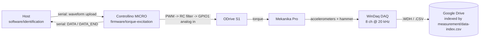

# Architecture

Short overview and pointers. The layout convention itself is specified in
[`doqs/docs/architecture.md`](../doqs/docs/architecture.md) — this file does not restate it.

## What this project is

AQTUATOR investigates **chatter suppression on a Mekanika Pro milling machine** by adding an active
actuator. The work so far has been to characterise the machine — measure its frequency response and
stability limits under stepper and servo drives — so that an actuator can be designed against real
numbers rather than assumptions.

The repository holds the machine: its CAD, the models that predict its behaviour, the campaigns that
measured it, and the firmware and host software built to run those campaigns.

## Module map

| Folder | What |
| --- | --- |
| [`cad/`](../cad/) | FreeCAD models of the machine and the actuator |
| [`architecture/`](../architecture/) | SysML requirements and block definitions |
| [`simulation/`](../simulation/) | Design-time models: structural dynamics, PWM/RC trade-off |
| [`measurement/`](../measurement/) | Physical campaigns — tap tests, stability tests — and the manifest indexing 1.88 GB of data held on Google Drive |
| [`firmware/`](../firmware/) | Controllino MICRO (RP2040) targets |
| [`software/`](../software/) | Host-side Python: identification stack, measurement tooling |
| [`docs/log/`](log/) | Chronological record of the work (activity log) |
| [`docs/decisions/`](decisions/) | Why things are the way they are |
| [`docs/mistakes/`](mistakes/) | What not to repeat |

## Linear-stage family (proposed)

When the stage CAD starts, do not fork a repo per length or motor, and do not turn motors
and encoders on and off from a FreeCAD spreadsheet. Length is a parametric `[[model]]` of a
shared core; motor and feedback families are thin composition modules; a downstream machine
vendors the **family** as one submodule and pins composition + model in `builds/`.

Proposed ADR:
[`docs/decisions/2026-08-31_linear-stage-variant-structure.md`](decisions/2026-08-31_linear-stage-variant-structure.md).
The module tree itself is not created until that ADR is accepted.

## The identification signal chain

The central technical arrangement: a torque command generated on the host reaches the ODrive as an
*analog* voltage, because the CAN path could not sustain the required rate.

Workflow B bypasses the Controllino entirely and captures inside the ODrive over USB at the
control-loop rate.

Details live with the code they describe:
[`firmware/torque-excitation/README.md`](../firmware/torque-excitation/README.md) for the serial
protocol, PWM behaviour, pin mapping and safety invariants;
[`software/identification/README.md`](../software/identification/README.md) for both workflows and
the ODrive lifecycle.

## Hardware generations

Two earlier generations were tried and abandoned; their code is deleted but recoverable from git
history and the `dev-nucleo` / `dev-gui` branches.

| Generation | Outcome |
| --- | --- |
| Arduino Opta | Analog output could not exceed ~20 Hz — [dev-log 2025-11-14](dev-log/2025-11-14_opta-analog-bandwidth-limit.md) |
| NUCLEO-G474RE + CAN | CAN torque commands too slow and awkward — [dev-log 2025-12-10](dev-log/2025-12-10_nucleo-odrive-can-connection.md) |
| **Controllino MICRO + PWM→GPIO1** | Current — [decision record](decisions/2026-03-25_replace-can-torque-with-pwm-to-gpio1-analog-mapping.md) |
