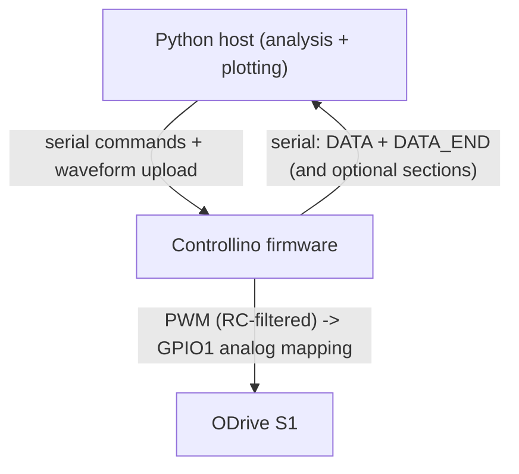

# Architecture

## Goal
This project performs synchronized data acquisition and motor control using an `ODrive S1` drive:
- A host computer (Python) sends a torque waveform to a microcontroller.
- The microcontroller plays the waveform as **PWM (RC-filtered analog) into ODrive GPIO1** while sampling multiple analog channels.
- The host retrieves the recorded data over `serial` and computes analysis (time-domain plots and frequency-domain transfer estimates).

## Main components
### Microcontroller firmware (Controllino Micro / RP2040, Arduino IDE)
- Torque playback + multi-channel acquisition: [`src/controllino/main-controllino/main-controllino.ino`](src/controllino/main-controllino/main-controllino.ino)
  - Serial protocol: `UPLOAD_CSV` / `START_OUTPUT` / `START_IDENTIFICATION` / `GET_DATA` / `GET_STATUS`
  - Timing: RP2040 repeating timer ISR drives both **PWM compare updates** and ADC sampling on the same sample tick
  - PWM debug/runtime modes: compile-time `PWM_RUNTIME_MODE` selects between mixed Arduino setup + low-level ISR updates, fully low-level PWM setup, or `analogWrite()` directly inside the ISR as a fallback experiment
- Servo system identification (ODrive feedback capture): [`src/controllino/controllino-servo-identification/controllino-servo-identification.ino`](src/controllino/controllino-servo-identification/controllino-servo-identification.ino)
  - Serial protocol: `START_ACQUISITION` / `GET_DATA` / `GET_STATUS`
  - Timing: cyclic CAN messages from ODrive are paired (torque + position) and streamed back to Python
- Standalone 8 kHz controller (A0/A1/A3 -> x_spindle -> filters -> PWM):
  - [`src/controllino/spindle-controller/spindle-controller.ino`](src/controllino/spindle-controller/spindle-controller.ino)
  - Timing: 8 kHz RP2040 repeating timer ISR computes the control output; `loop()` applies the pending PWM duty
  - Enable gate: `GPIO1`/`D1` must be HIGH to run the controller; otherwise PWM is forced to 0 and filter states are reset

### Controllino MICRO pin-mapping convention (important)
- For `controllino_rp2` Arduino sketches, treat MICRO header `GPIO0`/`GPIO1` as direct RP2040/Arduino pins `D0`/`D1`.
- Do not derive Arduino pin indices from RP2040 package-pin numbers in the chip pinout drawing.
- Source of truth for firmware pin constants:
  - Controllino MICRO datasheet + block diagram
  - `controllino_rp2` `pins_arduino.h` (defines `D0 = 0u`, `D1 = 1u`)

### Host-side control + analysis (Python)
- Torque waveform + acquisition workflow (sequential phase 1): [`src/python/main_sequential.py`](src/python/main_sequential.py)
  - Uploads the waveform via serial, starts `START_IDENTIFICATION`, then calls `GET_DATA`
  - Prompts operator for ODrive `CONTROL_MODE` at runtime (`p`/`t`, default `p`)
  - Forces `odrv0.axis0.config.enable_step_dir = False` at startup so torque-command path can run, then restores it to `True` after identification/cleanup
  - Logs ODrive `GPIO1` analog-input state after configuration, before closed-loop, after closed-loop, and after cleanup so Python-side runs can be compared against the working manual GUI setup
  - Plots time series and a Bode-like transfer estimate via `scipy.signal.csd`/`welch`
- ODrive frequency sweep identification: [`src/python/odrive_servo_identification.py`](src/python/odrive_servo_identification.py)
  - Sweeps frequencies, configures ODrive cyclic CAN message rates, starts `START_ACQUISITION`
  - Estimates gain/phase from the recorded torque setpoint and position estimate
- ODrive configuration wrapper: [`src/python/odrive_config.py`](src/python/odrive_config.py)
  - Connects to ODrive over USB and sets control mode / input mode / closed-loop state
  - Reasserts and verifies `odrv.config.gpio1_mode == ANALOG_IN` before the analog torque endpoint is used

### Notes on the PyQt GUI script
- There is also [`src/python/main_controller.py`](src/python/main_controller.py), a PyQt5 GUI.
- Its serial command set and channel expectations appear to correspond to a different (non-current) firmware protocol than the Controllino sketches.
- Treat it as an alternate/legacy entrypoint unless you confirm the serial protocol matches your connected firmware.

## Data flow (overview)

## Workflow A: Torque playback + multi-channel acquisition
### Serial frames (Controllino firmware)
The Controllino torque/acquisition firmware uses framed serial messages:
- `UPLOAD_CSV,<num_lines>` -> responds `READY`, then `ACK: CSV loaded` or `NACK: CSV load failed`
- `START_OUTPUT,<duration>`
  - responds `ACK: Output started`
  - during output, serial is blocked
  - completion is signaled with `ACK: Output complete` from the `loop()`
- `START_IDENTIFICATION,<acquisition_duration>,<acquisition_start_delay>`
  - responds `ACK: Identification started`
  - starts torque playback immediately; acquisition begins after the start delay
  - when acquisition completes, firmware emits `ACK: Acquisition complete`
- `GET_DATA` streams:
- header: `DATA:<sample_count>,<sample_period>,2`
- samples: per-line floats in this order: `torque_command,x_spindle`
  - terminator: `DATA_END`
- `GET_STATUS` now also reports RP2040 PWM debug state for Workflow A:
  - runtime mode
  - slice / channel
  - current GPIO function
  - requested/written duty
  - compare register snapshots (`CC A` / `CC B`)
  - `TOP`, `CSR`, and write counters

### Analysis done in Python
[`src/python/main_sequential.py`](src/python/main_sequential.py) transforms the received samples into:
- a time vector using `sample_rate = 1.0 / sample_period`
- time-series plots of `torque_command` and `x_spindle`
- a Bode-style transfer estimate (`torque_command` -> `x_spindle`) using `scipy.signal.csd`/`welch`

Confirmed diagnosis from the 2026-03-31 investigation:
- The Controllino PWM path was working once verified with `GET_STATUS`, RC-output voltage measurements, and waveform playback on the RC filter.
- The bad negative-torque behavior during Python-driven runs came from the host-side ODrive lifecycle being insufficiently observable/trustworthy, not from a proven RP2040 PWM failure.
- The high-value ODrive invariant for this workflow is now: `gpio1_mode` must remain `ANALOG_IN` whenever the analog torque path is expected to work.

Runtime ODrive state machine in this workflow:
- Startup: connect ODrive -> prompt/apply control mode (`Position` default or `Torque`) -> set `enable_step_dir=False`
- Run: verify/log `gpio1_mode` + analog mapping -> enter closed-loop for output/acquisition window -> re-check/log the same GPIO1 state
- Completion/cleanup: exit closed-loop -> clear analog endpoint while keeping `gpio1_mode=ANALOG_IN` -> set control mode to `Position` -> set `enable_step_dir=True`

Safety invariants for Workflow A:
- Controllino PWM output **must idle at 0 Nm**, not 0% duty. Reason: ODrive `GPIO1` has a pull-up; 0% PWM does not yield 0V after the RC network and can map to a non-zero (negative) torque.
- On the ODrive side, `odrv.config.gpio1_analog_mapping.endpoint` is cleared (`None`) when the axis is set to `IDLE`, and restored to the torque endpoint right before entering closed-loop. This limits when the ODrive listens to the external analog command.
- Python now treats `gpio1_mode` itself as a monitored invariant, not just the endpoint. If a run misbehaves, compare the printed `gpio1_mode`, endpoint, min/max, control mode, and input mode against the manual GUI state before changing firmware again.
- Keep `input_torque` feedforward enabled in both `Position` and `Torque` control modes for this project; the confirmed bug was not “using `input_torque` in `Position` mode,” but failing to verify the GPIO1 analog-input state across the Python lifecycle.
- For the identification sketch, the sampled input channel remains the commanded CSV torque. The firmware now updates the RP2040 PWM compare register directly in the timer ISR so that command generation and ADC sampling share the same sample tick without calling high-level `analogWrite()` from interrupt context.
- When debugging missing PWM output, validate in two stages:
  - Stage A: Controllino + RC output only, using `GET_STATUS` plus direct voltage measurement
  - Stage B: ODrive connected, after the RC output is already proven correct

## Workflow B: Servo identification (frequency sweep)
### ODrive cyclic CAN capture
In [`src/python/odrive_servo_identification.py`](src/python/odrive_servo_identification.py), ODrive is configured to emit cyclic CAN messages:
- message interval is set from the sweep parameter `ts`
- torque setpoints and encoder estimates arrive cyclically at the requested rates

### Serial frames (servo-identification firmware)
The Controllino servo-identification sketch streams:
- `START_ACQUISITION,<duration>,<cycle_time>,cyclic` -> `ACK: Acquisition started (cyclic mode)`
- `GET_DATA` streams:
  - header: `DATA:<sample_count>,<sample_period>,4`
  - samples per line:
    - `torque_setpoint, pos_estimate, torque_timestamp_us, pos_timestamp_us`
  - terminator: `DATA_END`
  - additional timestamp section:
    - `LOOP_TIMESTAMPS:<N>` ... `LOOP_TIMESTAMPS_END`

### Analysis done in Python
The sweep code computes transfer gain and phase at each excitation frequency from torque setpoint vs position estimate using `scipy.signal.csd`/`welch`-based estimation (`calculate_transfer_function()`).

