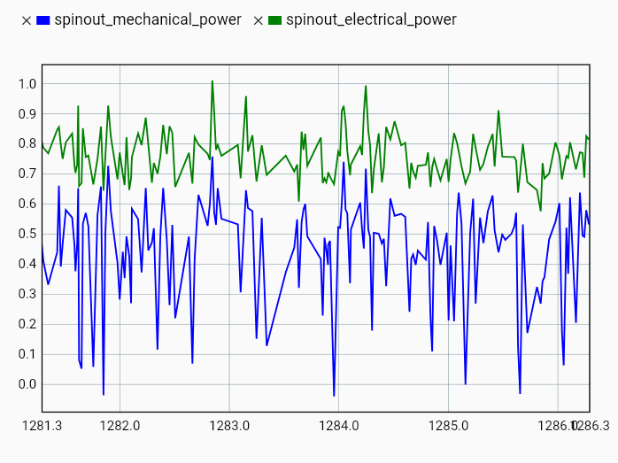
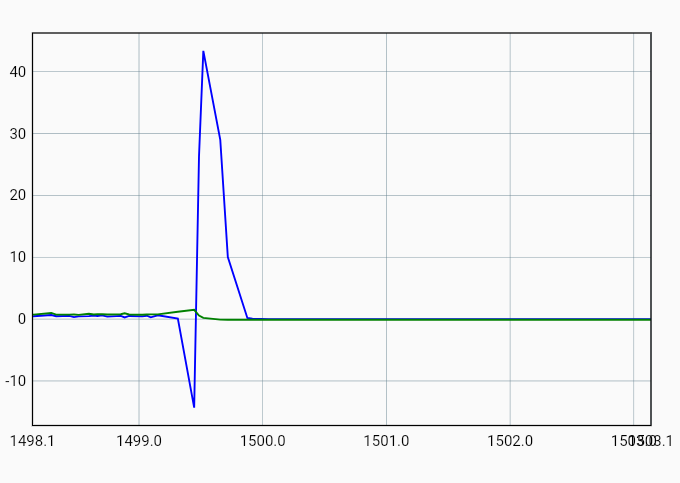
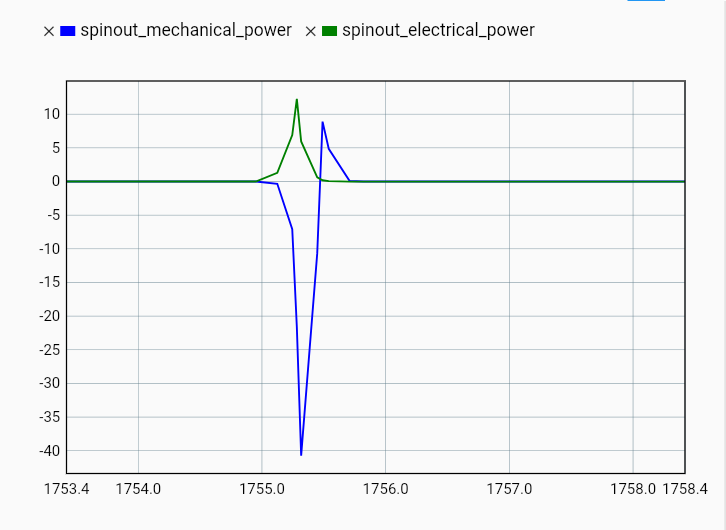
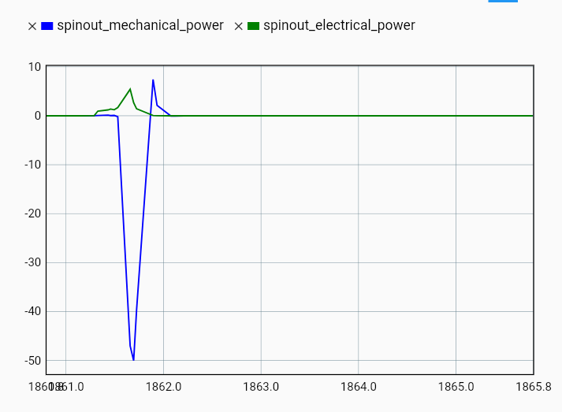

# 2025-11-04 — Servo motor setup

- Setup servo motor

  - Position measurement (RS485_encoder_group0 \> raw):

    - 1/(0.52716105-0.52709941) = 16223.232

      - Ok

  - Raw32 is the bit-value and is most accurate

- Spinout error

  - Velocity control, 0.5 Gain

  - Velocity control, 0.8 gain

    - \
      

    - Increase limits to mechanical power spinout limit to -20:\
      

    - Increase limits to mechanical power spinout limit to -100:\
      
