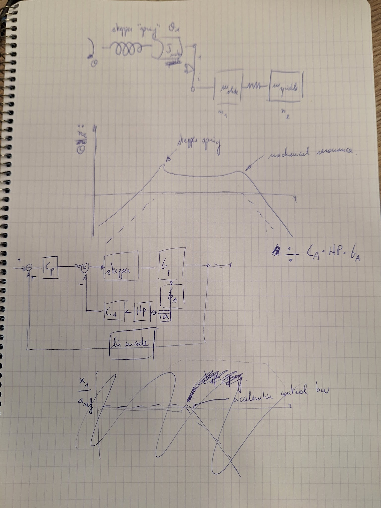

# 2025-11-27 — Stepper drive pulse/direction control

- Can we use the stepper Drive and adjust the pulse and direction sent by the controller?

  - Can the Arduino read the encoder signals?

  - Can the Arduino send pulse and direction at these speeds?

  - Can we split the loops into a position counter, a pulse generator and a control loop?

- Can the AdvancedAnalogADC get in single measurements that are overwritten?

- Answers to questions above: [<u>https://gemini.google.com/u/2/app/0a928c7cc3ed2529?pageId=none</u>](https://gemini.google.com/u/2/app/0a928c7cc3ed2529?pageId=none)

  - Yes, all of this is possible but requires some thought and splitting over 2 cores

- How should the control loop look like?

  - Torque feedforward conflicts with position loop. How to take this into account and still benefit from creating a high-bandwidth loop?

  - <!-- A diagram here was a Word drawing canvas and did not survive export to markdown; see docs/log.docx in the Drive archive. -->

  - Why all the feedforward?

    - FFp (1, passthrough) makes sure that at low-frequencies, the desired position is just fed through to the stepper

    - FFa (1, only double differentiation required) provides the desired acceleration immediately to the acceleration control loop

  - Why FF from output of Cp directly to stepper?

    - C_A contains a high-pass filter. If we don’t do the FF, all the low-frequency control is ignored.

      - We should put a **HP filter before C_A and a LP filter to the other**

  - Doing like this, the position measurement and acceleration measurement are in conflict. If the linear encoder detects a high-frequency disturbance and the accelerometer is not, it is still passed to the acceleration loop.

    - We should **cut the loop**. The Cp output is fed directly to the stepper with an LP filter.

  - Which systems do the acceleration loop and the position loop see?

    - Acceleration loop:

      - Input: position/angle

      - Output: acceleration

      - For a normal system, without a compliant ballscrew:

        - Stepper acts as a spring (see figure below)

        - Dynamics of the system (e.g. mass - spring - mass)

      - Low frequencies:

        - Double derivative (+40dB/dec slope up)

      - High frequencies:

        - -40 dB/dec (mass line of second mass)

      - Intermediate

        - Constant

    - Position loop

      - Sees \[-20 db/dec - -40dB/dec - -80dB/dec\`\] / \[C_A x G_a x HP\]

      - Most probably a region of -40dB/dec before the acceleration loop bandwidth to control the system.

    - 

  - Why is the FFa on the acceleration reference and FFp directly on the stepper?

    - FFp is like a torque feedforward.
