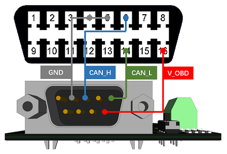
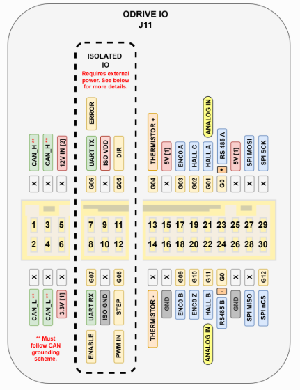

# 2025-12-10 — NUCLEO ODrive CAN connection

- CAN connection of NUCLEO-G474RE to ODrive S1

  - The ground of the Nucleo needs to be connected to GND of the ODrive S1

  - The USB links the ground of the Nucleo to the ground of the laptop, thus the power supply of the laptop should be disconnected when sending CAN commands!

  - Also the screen is connected to the ground through the HDMI cable.

  - So we need an USB isolator.

  - 

  - 

- Test CAN control

  - ODrive node ID = 0

  - Cannot get it to work

  - Debug by checking with an USB to CAN device if the Nucleo is actually sending any messages on the Bus.
