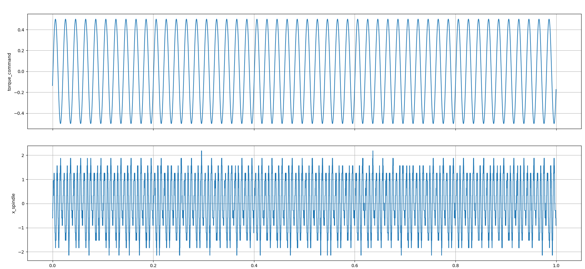
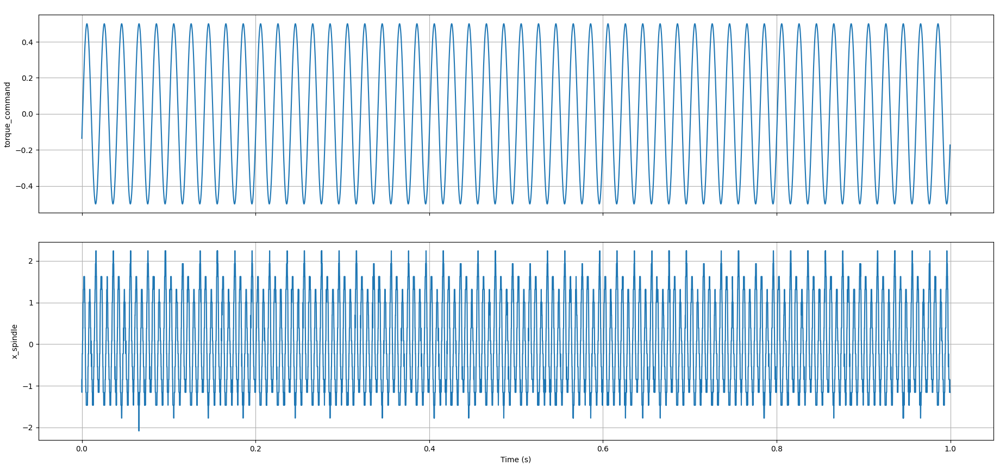
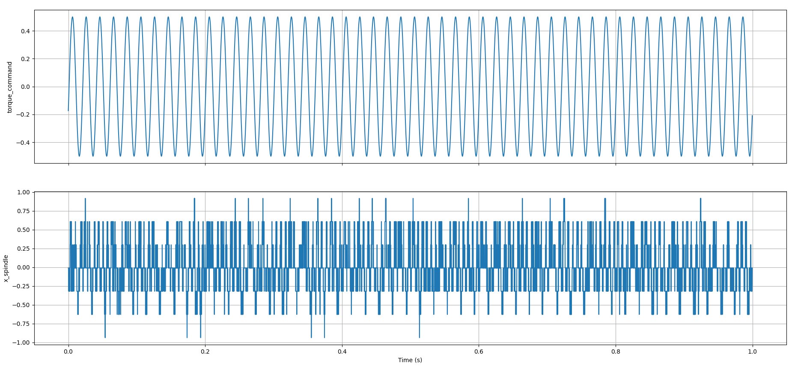
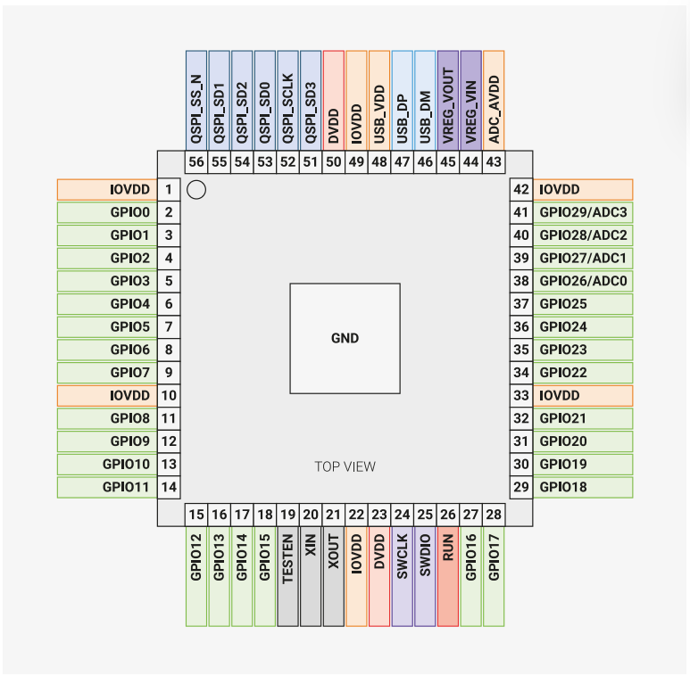
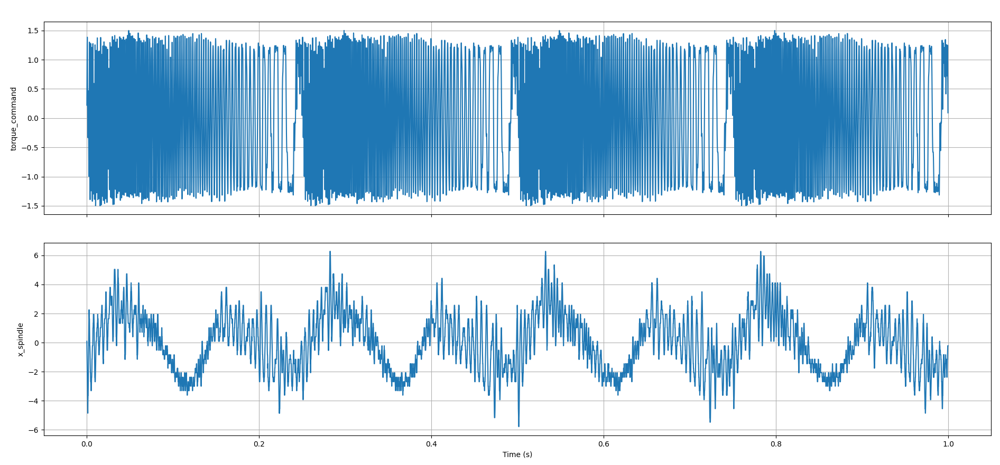
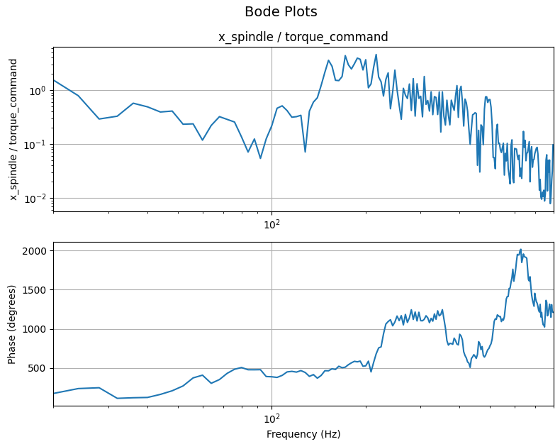

# 2026-03-31 — Multisine identification

**Identification with multisine**

- Problem: If we input a pure sine wave, we get a sine wave with a higher frequency at the output as well:

  - Below is a figure where x_spindle is actually acc_spindle_right.\
    

- Check what happens if we remove the sensor cables from the cable carrier.

  - 

  - Slight difference

- Check acc_workbed_x:

  - 

  - A bit smaller, but seems to be the same frequencies.

  - The accelerations are really low. Can we actually measure the frf at such low frequencies?

- Are we sampling the right channels? Maybe there is crosstalk to other channels.

  - Pinout RP2040:\
    

  - The bits seem to be correct and the output measured as well.

**System identification**

- The motor is mostly exciting the motor and ballscrew flexure mechanism instead of the stage.

- Multisine 20Hz to 800Hz, fs 8000Hz, 1.5Nm peak torque\
  \
  
