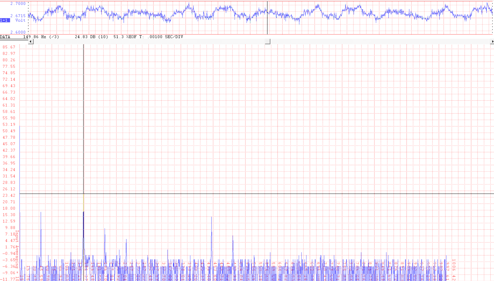
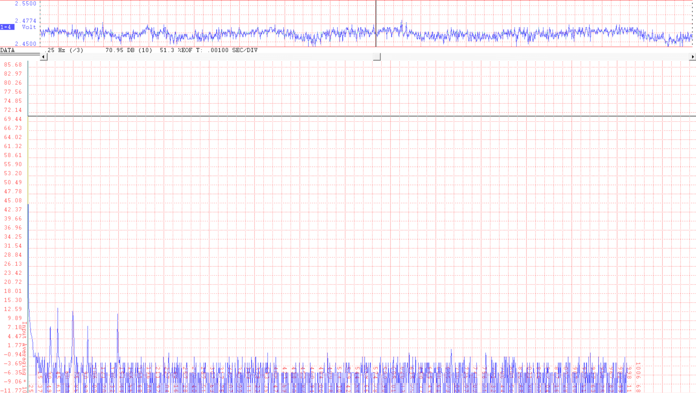
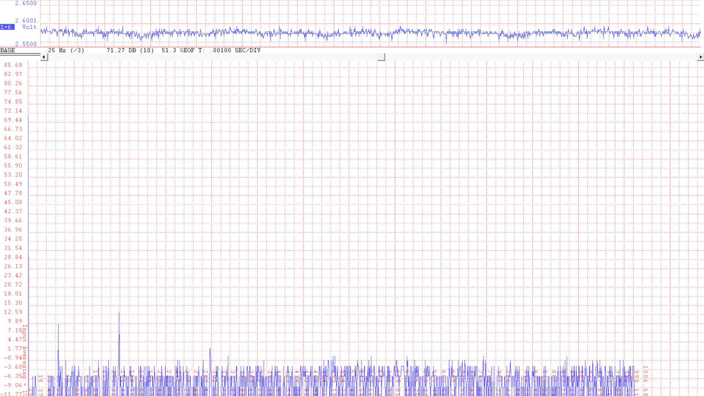
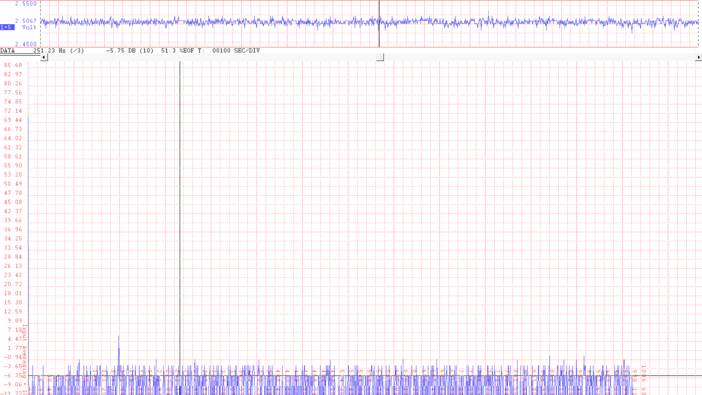
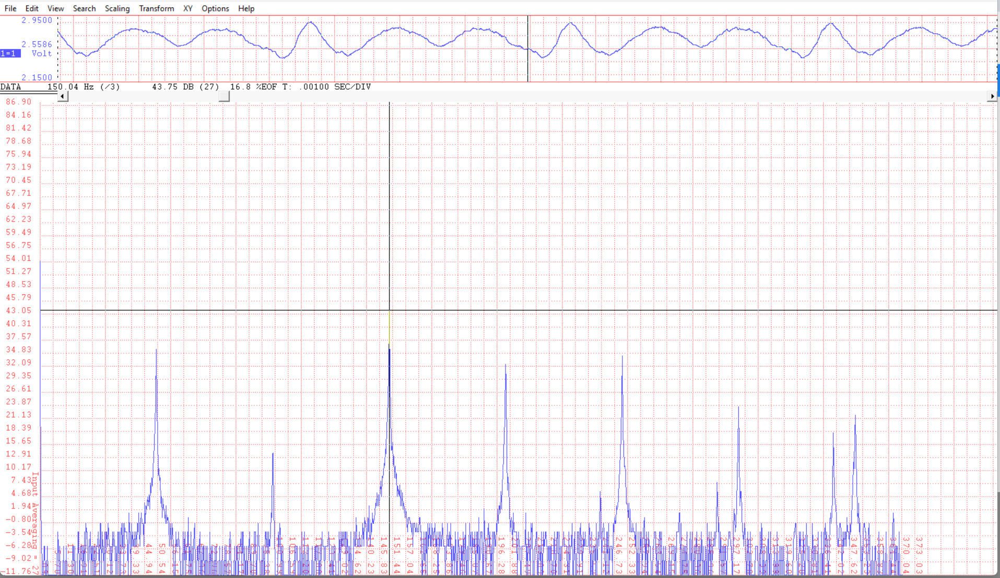

# 2026-04-01 — Accelerometer system identification

**Accelerometer system identification**

- Generated a sine wave in the ODrive (0.5Nm, 50Hz, position control)

  - Measurement with DataQ (acc_spindle_left):\
    

  - Clear 150Hz signal in the acceleration

    - Physical movement?

    - Motor EMI?

  - Signal also present in acc_workbed_x, but not as high:\
    

- Regardless of EMI, what is the expected acceleration?

  - T = 0.5 Nm

  - m = 8kg

  - alpha = 51°

  - dx = 0.001 m

  - Acceleration = cos(alpha) \* T \* 2 \* pi / (dx \* m) = 24 m/s² =\> 0.5 V amplitude.

    - This is NOT the case!

  - Also present in accelerometer lying on the worktable below the machine:\
    

  - Signal slightly present in acc_workbed_y:\
    

**Analysis of the mechanical system**

- Inertia of rotor is significant:

  - The inertia of the rotor + ball screw = 9.26e-5 + 2.93e-5.

  - The inertia is reflected to the stage with (2\*pi/pitch)^2, so this corresponds to an equivalent mass of 48 kg!

- Claude analysis: [<u>https://claude.ai/share/e2926744-ae57-4f80-adef-6b6748916a62</u>](https://claude.ai/share/e2926744-ae57-4f80-adef-6b6748916a62)

  - Why is the true acceleration of the stage decreased so much?

**Testing with fixed leaf spring**

- Higher acceleration output.
