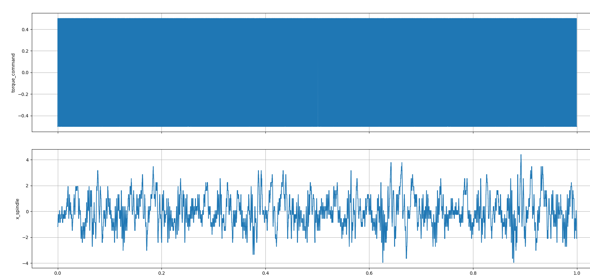
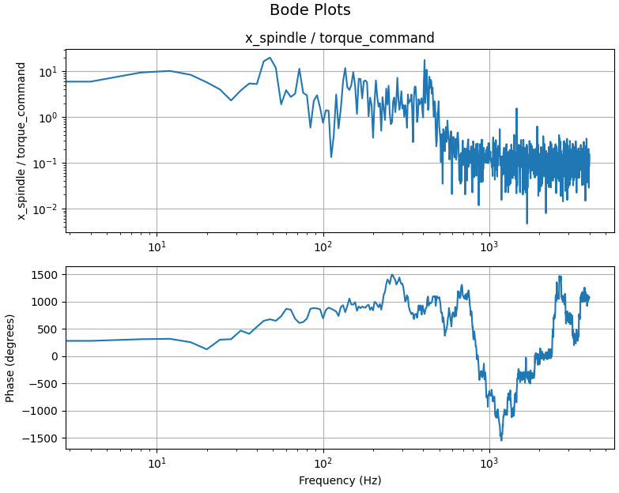
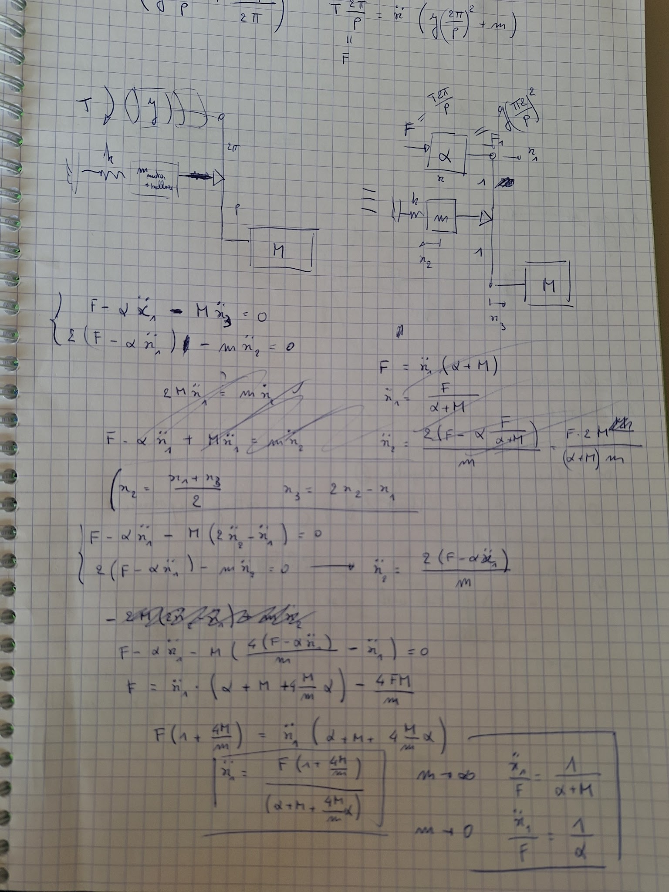
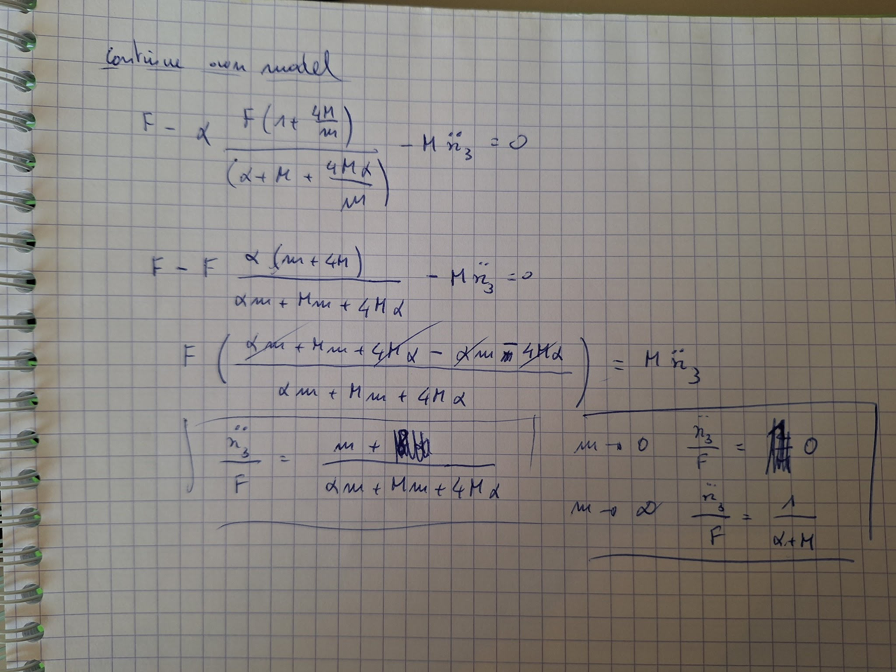

# 2026-04-03 — System non linearities

- Non-linearities of system likely due to:

  - ODrive current amplifier

  - Friction (less likely)

- Tried to apply a binary waveform (only +1/-1).\
  \
  

- The resulting FRF is slightly better, but still unusable.

**ODrive S1 linear encoder configuration**

odrv0.inc_encoder0.config.enabled = True

odrv0.axis0.config.load_encoder = EncoderId.INC_ENCODER0

odrv0.inc_encoder0.config.cpr = 1000

odrv0.axis0.pos_vel_mapper.config.use_index_gpio = False

odrv0.axis0.config.commutation_encoder = EncoderId.RS485_ENCODER0

odrv0.rs485_encoder_group0.config.mode = Rs485EncoderMode.AMT21_EVENT_DRIVEN

**Simplified system model**

**ATTENTION: this model is not correct! X_2 motion is missing a factor 2**

