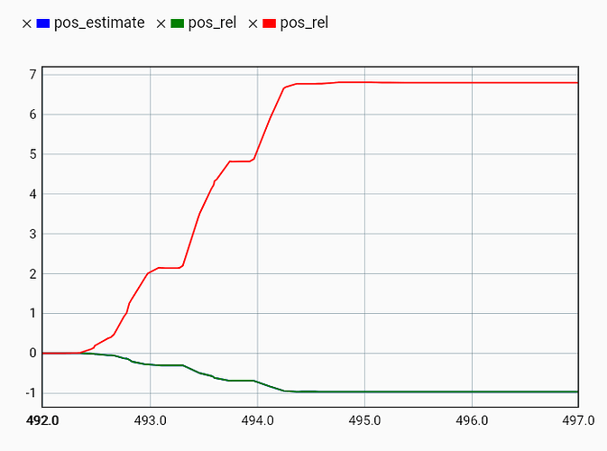
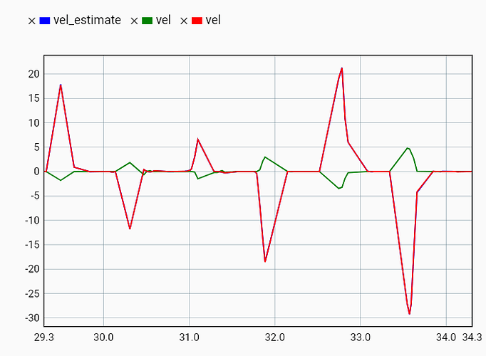
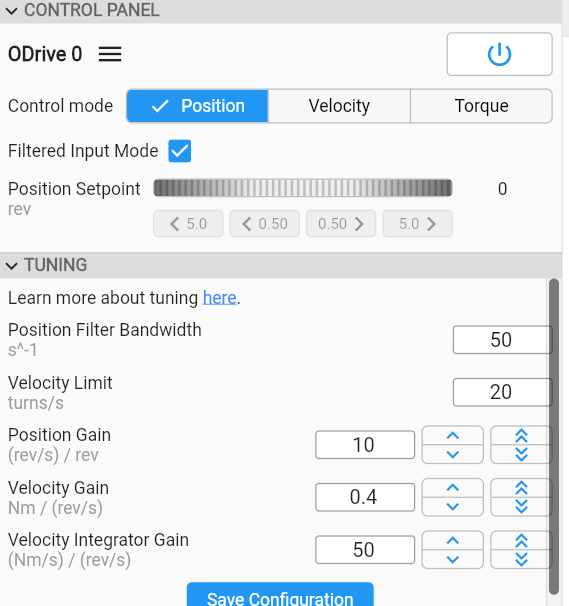
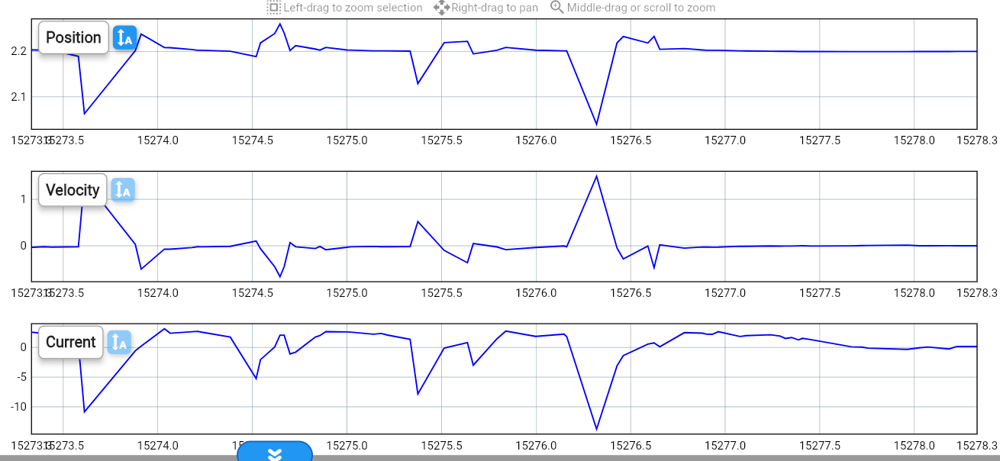

# 2026-04-16 — Stability with flexibility

**How to improve stability of the system with flexibility?**

Use commutation encoder as the velocity estimation.

When we use the linear encoder, there are two points where it can get unstable:

1.  The pole-zero -270° drop caused by the flexibility of the ball-screw-motor suspension.

2.  The drop to -270° at the first resonance frequency (probably due to the flexibility of the coupling).

**Post on ODrive forum where I explain how to set the parameters for using the commutation encoder as the velocity estimation**

I’m tried now to set use_commutation_vel to True, and indeed it made everything more stable. I had some struggles setting the right parameters for inc_encoder0.config.cpr and axis0.controller.config.commutation_vel_scale, so I thought I’d share what I found, so others can also see it.

My encoder has a resolution of 1 µm, which means the A and B signals both have a pulse every 4 µm and this is multiplied by 4 with the quadrature encoding. My ballscrew has a pitch of 10 mm. So every revolution of the motor, there should be 10000 counts, so I have set the cpr to 10000.

Then I checked the following parameters in the monitor while turning the ballscrew approximately 1 turn (I have set the circular range of the commutation encoder to 20, to avoid overflow:

<u>image700×520 17.8 KB</u>

axis0.pos_estimate (blue)

axis0.pos_vel_mapper.pos_rel (green)

axis0.commutation_mapper.pos_rel (red)

There is a difference in scaling with a factor -7. This factor also appears in axis0.commutation_mapper.config.scale and is set to -7 after running ENCODER_OFFSET_CALIBRATION. I can only set this value to -7 and 7, as it should match the pole pairs of the motor.

When I look at the velocity estimations, I can also see approximately that same ratio between the velocity of the control loop (vel_estimate, blue), the commutation mapper (vel, red) and the linear encoder (vel, green):

<u>image703×515 32.1 KB</u>

This meant that my velocity estimate is not correct and the polarity is reversed. That’s why I have set axis0.controller.config.commutation_vel_scale to -1/7 = -0.143.

**Tuning of controller**

When using step-dir without filtered input mode, the behaviour is worse.

Disturbance rejection is not good:\

My guess is that the torque and bandwidth are not high enough to get enough force to the motor. A disturbance is also immediately going to the flexible suspension instead of to the inertia of the ballscrew and motor.
