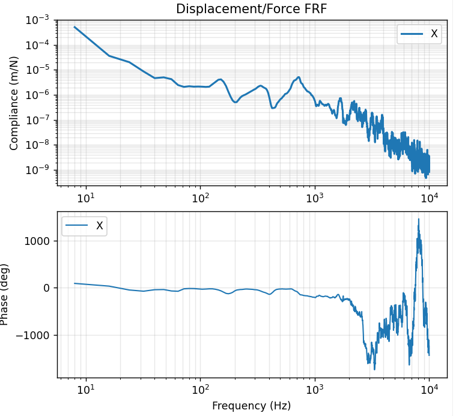
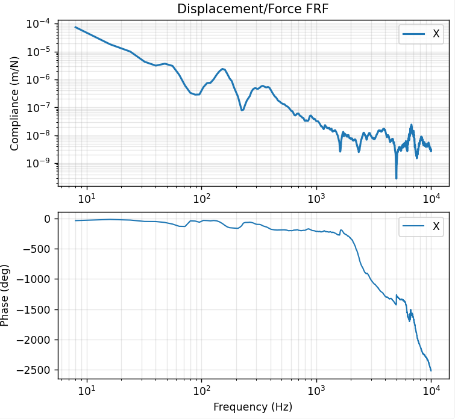
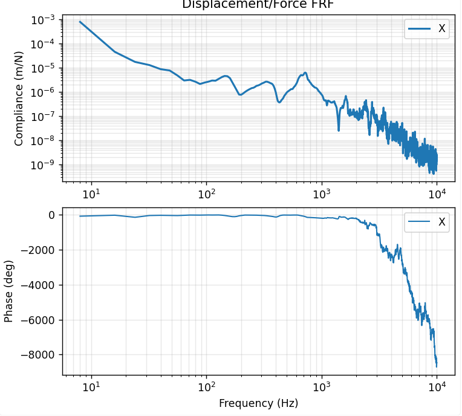
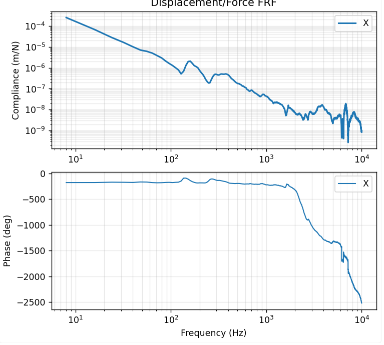
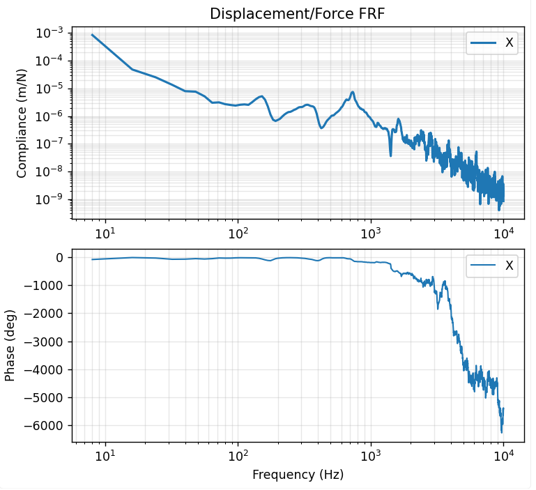
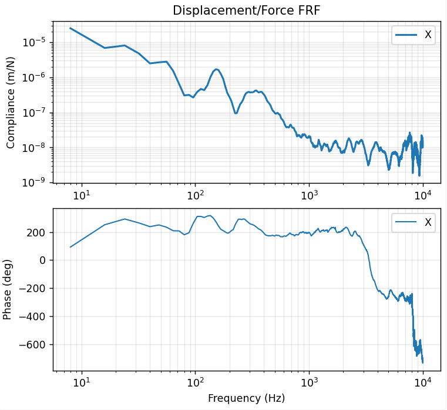
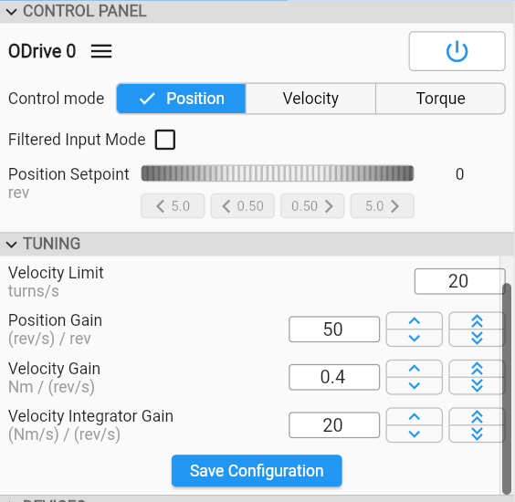
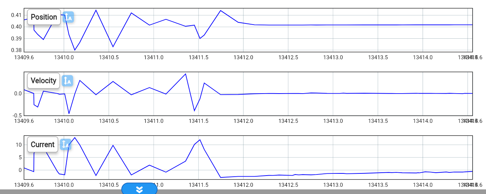
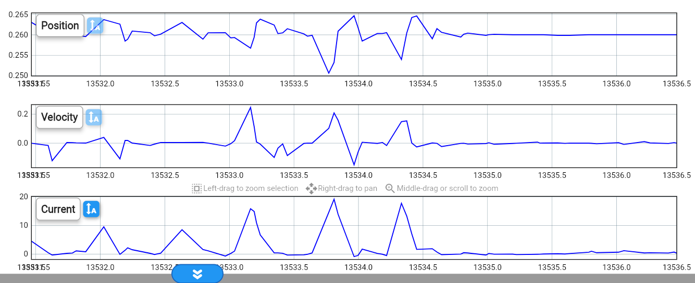

# 2026-05-07 — FRF and compliance measurements

## FRF measurements

**Stepper FRF at tool**

**Stepper FRF at Spindle**

**Conclusions**

- Compliance of spindle has resonance at 700Hz.

- Compliance of larger mass of slide doesn’t matter at high frequencies

- Lower frequency modes come from structure.

- Lower frequency modes have high damping.

**Rotary encoder FRF at tool**

**Rotary encoder FRF at spindle**

**Conclusions**

- There seems to be a lot more damping here than in the case of the stepper.

- Low-frequency FRF should be flat

- Maybe bad measurement?

**Linear encoder FRF at tool**

**Linear encoder FRF at spindle**

## 

**Conclusion**

- Not a lot of difference with stepper, maybe even a bit worse

- Static stiffness might be a bit better

## Compliance measurements of:

### configuration with stepper

- Displacement with 10kg Force at Gantry (top of gantry): 50 µm

- Displacement 10kg Force at top of X-slide (screw head right above bearing block): 70µm

- So nut + ball screw + bearing + stepper is responsible for 20 µm

### Configuration with servo with rotary feedback

- Displacement with 10kg Force at Gantry (top of gantry): 45 µm

- Displacement 10kg Force at top of X-slide (screw head right above bearing block): 82µm

- So nut + ball screw + bearing + servo is responsible for 37 µm

  - Servo is more compliant than stepper??

  - Correction of servo is not even visible in the measurements

  - Stiffness of coupling

    - 450 Nm/rad

    - With ballscrew: 450 Nm/rad \* (2pi / 0.01m)^2 = 177N/µm

  - What about the torsional stiffness of the shaft of the motor?

    - Angular deflection: alpha = 32 L T / (G π D4)

    - G = 79.3 GPa

    - L = approx 70 mm

    - D = 8 mm

    - T / alpha = 455 Nm/rad

    - T = 100 N \* 0.01m / (2 pi) = 0.16 Nm

    - Alpha = 3.5e-4 rad

    - Displacement = 0.56 µm

  - Reason for compliance could be eccentricity of the rotor, in combination with a flexible suspension with only 1 bearing. This causes the encoder to deflect and make a measurement error.

    - [<u>https://claude.ai/share/cdd372d0-de7e-4ff6-99cf-e5b3dcb61fcf</u>](https://claude.ai/share/cdd372d0-de7e-4ff6-99cf-e5b3dcb61fcf)

### Configuration with linear encoder feedback

- Compliance by force at gantry or force at top of X slide is almost the same (50 µm)

  - Servo corrects everything and we get a virtually stiff system.

## Tuning of controller with linear encoder (rigid setup)

Velocity integrator gain of 50 also worked, but had a bit of vibrations at stop

## Saturation of current

### Rotary encoder case

Hitting the spindle by hand

### Linear encoder case

### Conclusion

No saturation in these cases
