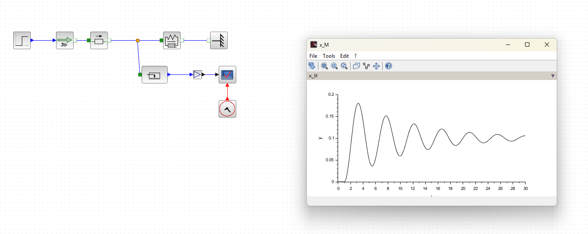
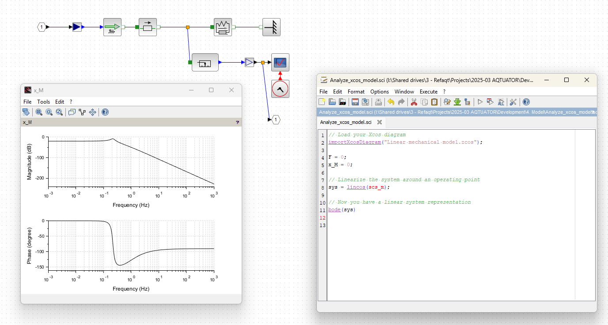

# 2025-09-09 — Xcos Coselica mass-spring-damper model

**Role(s):** engineering

- Xcos Coselica mass-spring-damper model example:\
  

  - To create the orange node, select the connector and drag to input of other block

- Create bode diagram:\
  

  - Output of phase is weird, should be -180°

- Do not use XCos and Scilab. Build models manually and simulate using Octave.
