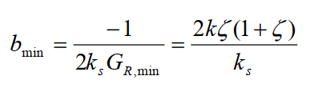
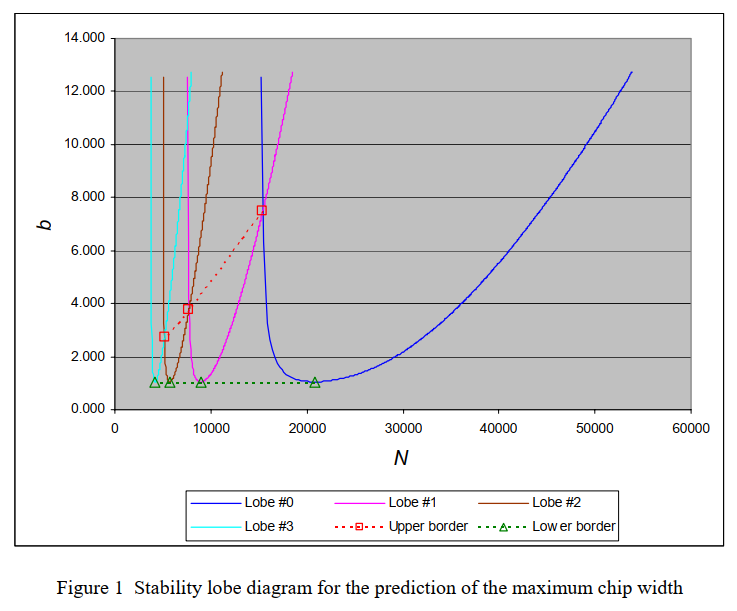

# 2025-10-09 — Maximum cutting depth vs damping and stiffness

**Role(s):** engineering

- Maximum cutting depth Ap (b_min in the next formula) is linearly dependent on damping and stiffness of the machine:

  - 

  - B_min represents the lower border of the stability lobe diagram (green dotted line on the graph below):

    - 

- What this means for a servo-controlled system with acceleration control:

  - Stiffness can be increased by higher controller gains.

  - Not sure what happens at very low frequencies, because there the controller will not increase the absolute stiffness.

  - Damping can be increased by higher phase margins.

  - Stiffness and damping will be determined by the modal stiffness of the first uncontrolled eigenfrequency of the machine.
