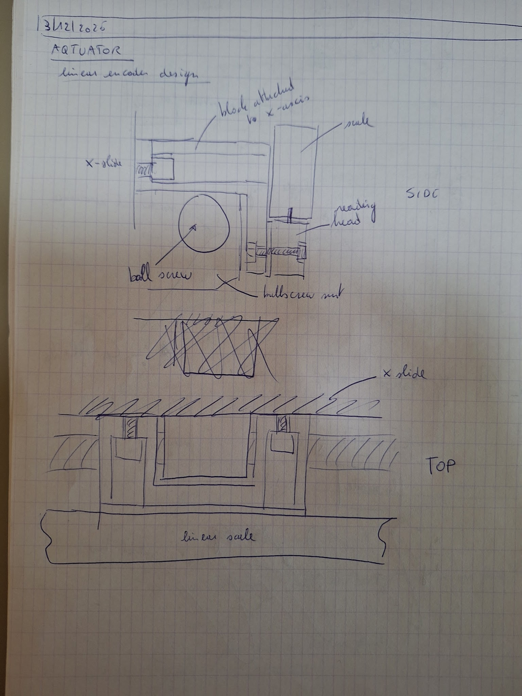

# 2025-12-03 — Linear encoder design

**Role(s):** engineering

Linear encoder design

- The linear encoder is mounted vertically with the reading head on the bottom, behind the ball screw.

- The inductive sensors are attached to the top alu profile, detect the X-axis plate and are positioned in between the ball screw and the profile.

- Conceptual drawing:

- Linear encoder electronics

  - [<u>https://claude.ai/share/8a14bf6b-bd76-49ff-8fb1-c47762b90395</u>](https://claude.ai/share/8a14bf6b-bd76-49ff-8fb1-c47762b90395)

  - RS-422 is preferred for low-noise and cable lengths more than 2m.

  - Add a differential receiver AM26LS32 and some resistors and capacitors to convert to A, B, Z.

  - Buy a prototyping shield for Arduino Uno to solder the components.

  - Make sure to protect the NUCLEO pins with resistors. Otherwise circuits could brake.
