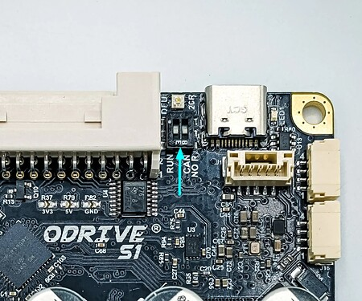

# 2026-01-06 — Controllino ODrive CAN communication

**Role(s):** engineering

- Controllino + ODrive S1 CAN communication

- ODrive S1: flipped jumper to get 120 Ohm termination resistance. (Had to break through some film on top of the switches)\
  

- 120Ohm termination resistor on Controllino still required (no internal one)

- 120Ohm termination resistor is already present on the ODrive USB CAN adapter via a DIP switch.

- We need to remove passive usb hub to have enough power.
