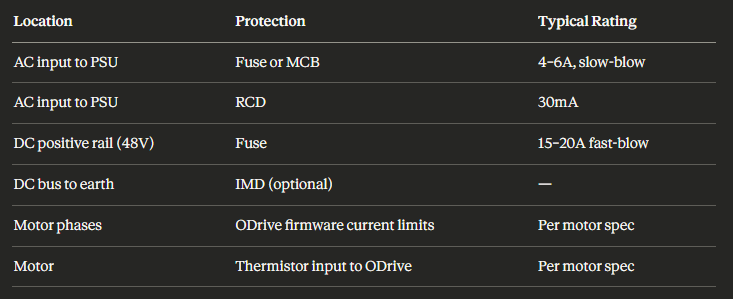

# 2026-02-24 — Electrical cabinet electronics

**Role(s):** engineering

Additional electronics for electrical cabinet:

- [<u>https://claude.ai/share/47c3b9fd-8a02-4d52-8f69-fee18606fe66</u>](https://claude.ai/share/47c3b9fd-8a02-4d52-8f69-fee18606fe66)

- 

  - AC input to PSU

    - Miniature Circuit Braker (MCB) or Fuse

    - 4-6A, slow-blow

  - AC input to PSU

    - Residual current device 30 mA

  - DC positive rail (48V)

    - Fuse

    - 15-20A, fast-blow

- EMC filter

  - Mains → EMC filter → MCB/fuse → PSU → ODrive (PSU = 48V power source)

  - 6-10A capacity

  - Rated at 250V AC

  - 1-2mA max leakage current
