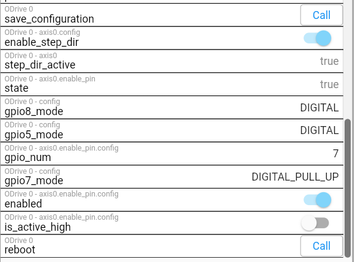
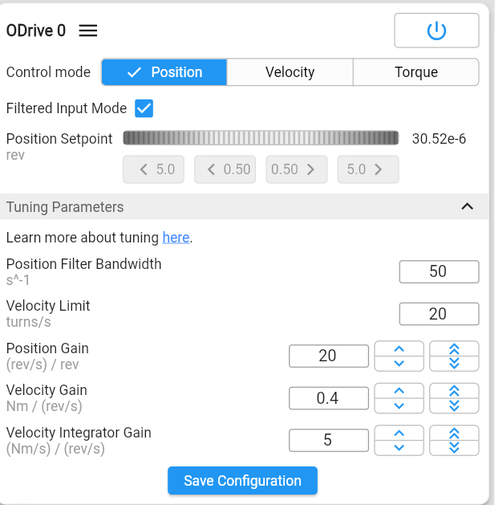
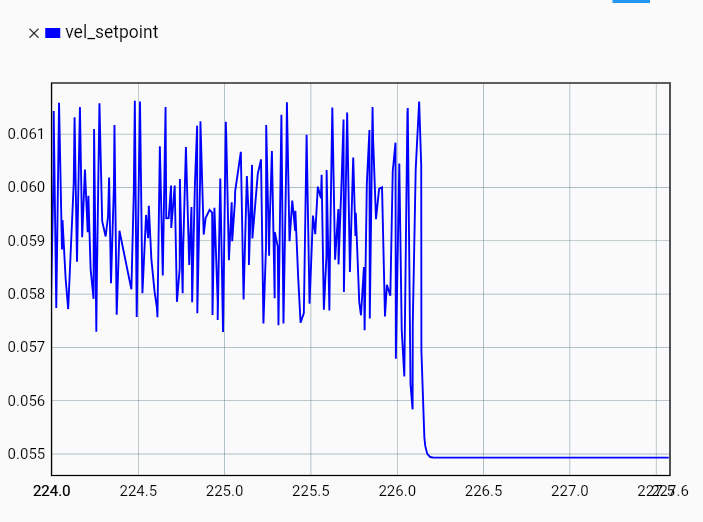
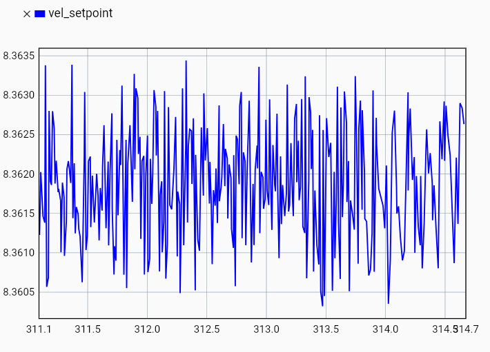
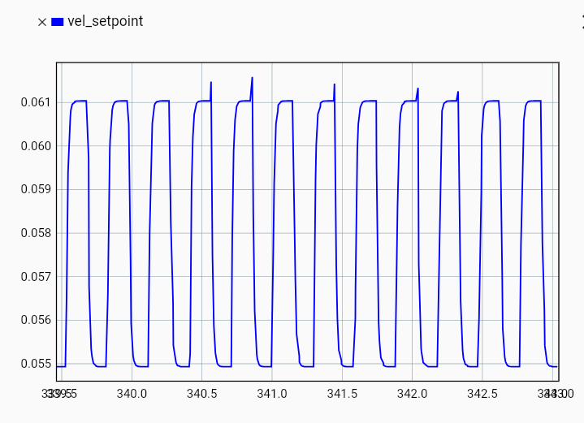

# 2026-03-04 — PlanetCNC step/dir/enable signals

**Role(s):** engineering

**Step/Dir/Enable from Planet-CNC**

- The Step/Dir/Enable signals are inverted, so 5V when disabled, 0V when enabled

- Settings \> Motors

  - Enable “On ESTOP”

  - “Invert” for the X-axis should be

    - OFF when using ODrive

    - ON when using stepper Drives

- Settings in ODrive:

  - 

  - Gpio7_mode needs to be DIGITAL_PULL_UP

  - Is_active_high = FALSE means that when enable signal is low, the axis is active

- Position controller PID settings (motor fixed to gantry)

  - 

  - Position gain 20

  - Velocity gain 0.4

  - Velocity Integrator Gain 5

**What is the position error?**

- Measure velocity setpoint and divide by position gain:

  - 10 mm/min:\
    

    - Position gain: 40

    - (0.062-0.057)/40 = 1.25e-4

    - Times the ball screw pitch of 10 mm: 1.25 µm error.

  - 5000 mm/min

    - 

    - (8.3635-8.3605)/40 \* 10mm = 0.75 µm

  - 1 mm/min

    - 

    - 0.006/40\*10mm = 1.5µm
