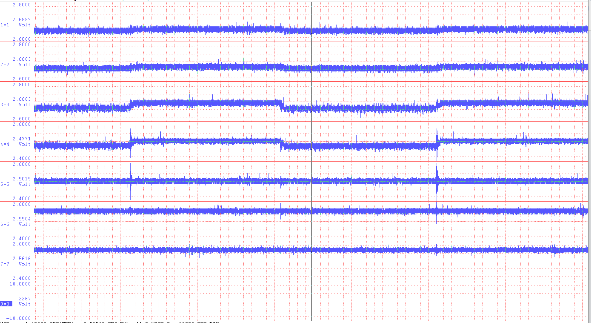
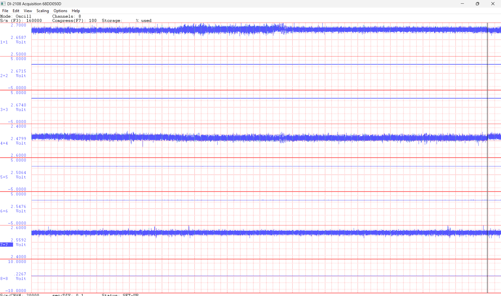

# 2026-03-10 — ODrive motor noise on accelerometers

**Role(s):** engineering

**Influence of ODrive motor noise on accelerometers.**

Switching controller on or off:\

Moving the motor has no significant effect:

Channel 1: moving accelerometer on spindle.

Channel 4: accelerometers on workbed.

Channel 7: accelerometer lying on worktable (50g sensitivity)

**Position input filtering**

Set to PASSTHROUGH

**Coupling clamping force**

- Measured 1Nm torque on bolts

- Equals 13kN clamping force

- Approx 7 Nm (with 0.1 friction coefficient) clamping on ball screw
