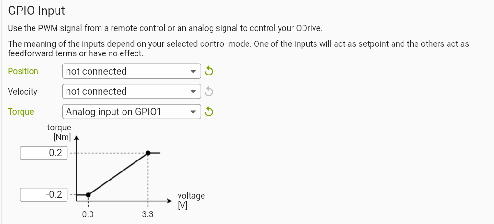
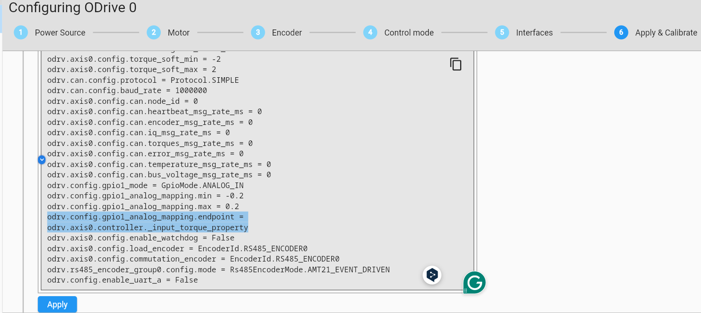
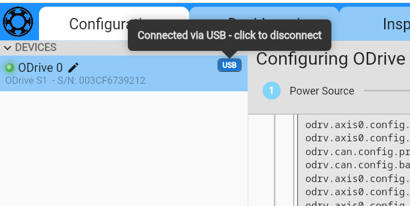
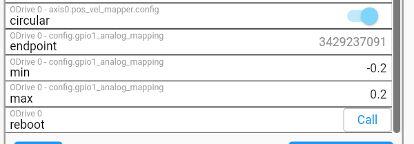
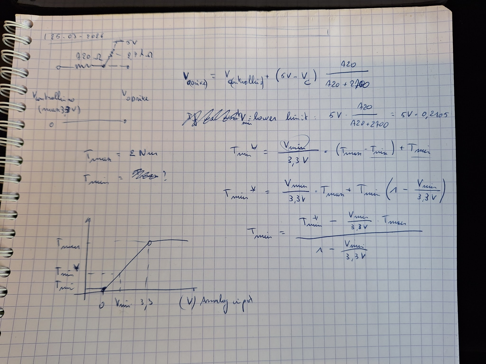
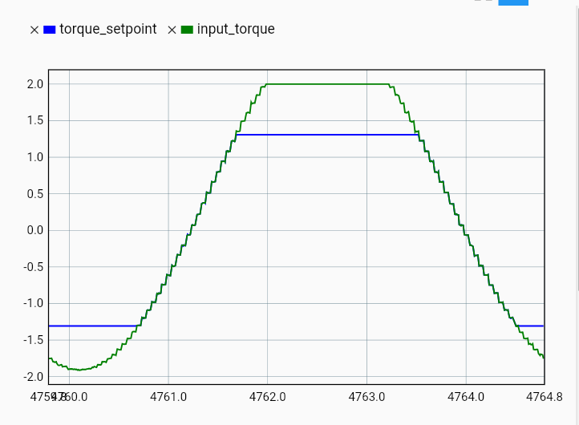
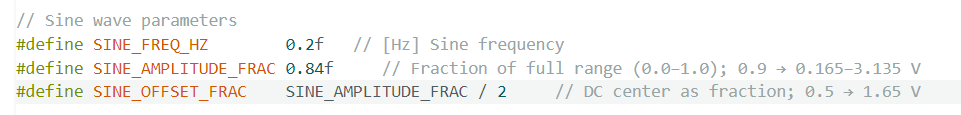
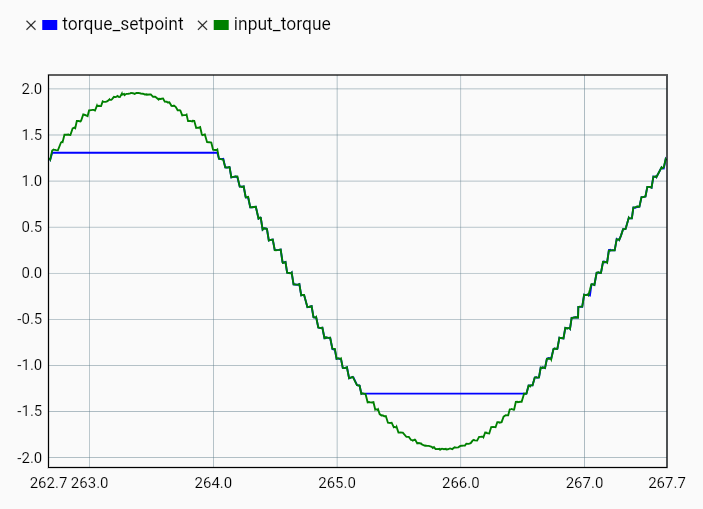
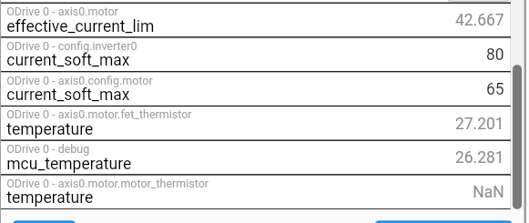

# 2026-03-25 — ODrive analog torque input

**Role(s):** engineering

**ODrive S1 with analog input**

- Tested outputting sine torque from 0.2 Hz until 800Hz using PWM, double RC-filter and ODrive analog input.

  - Injected torque as feedforward while position loop was on.

  - Works well.

  - Used test-pwm-output.ino.

    - Reduce SINE_TABLE_SIZE so max number of samples per second never exceeds 8000. When trying with more samples, Controllino crashed and it was hard to put a new program on it or even connect with USB.

- How to set to torqe as input.

  - Set analog input as GPIO in “Interfaces” in the ODrive dashboard:\
    

  - Do not save anything!

  - Copy these Python commands:\
    

  - Close the USB connection of the GUI (click on the USB label)\
    

  - Open cmd on windows and type “odrivetool”

  - Paste the command, but change odrv to odrv0, or the right name of the odrive.

  - Go to inspector and set the analog mapping:\
    

- The mapping will not be entirely correct because there is a resistor divider circuit because of the RC filter.

  - The analog input GPIO1 on the Odrive has an internal pull-up resistor of 2.7kOhm to 5V: [<u>https://docs.odriverobotics.com/v/latest/hardware/s1-datasheet.html</u>](https://docs.odriverobotics.com/v/latest/hardware/s1-datasheet.html)

  - In the RC filter, we use 6 x 120 Ohm resistors = 720 Ohm.

  - This means the minimum value (if GPIO0 of Controllino is at 0V) is 5V \* 720 / (720 + 2700) and the maximum is at maxPWM + (5V - maxPWM) \* 720 / (720 + 2700)

**Setting the limits of the ODrive Analog input**

- Max output of Controllino GPIO0 PWM is 3.3V (measured with multimeter)

- 

- V_min = 1.0526 V

- T_min = (T_min_star - V_min/3.3\*T_max)/(1-V_min/3.3)

- T_min_star = -2 Nm, T_max = 2 Nm: T_min = -3.8735 Nm

- This gives a topped off sine:\
  

- We have to set a maximum output in Controllino as well, because at 3.3V, the output measured at the ODrive input will be higher than 3.3V.

  - V_ODrive,max = 3.3V = Vc(ontrollino),max + (5V - V_c,max) \* 720/(2700+720)

  - Vc,max = 2.8467V

  - Vc,max / 3.3V= 0.8626

  - I have set these values in Controllino:\
    

  - This is the output:

  - 

  - Good enough for now.

- The torque setpoint is even topped off at 1.3V. Why?

  - Because of effective_current_lim, which is lowered because of temperature. We are not using the motor thermistor, so probably the current is limited because of that.\
    
