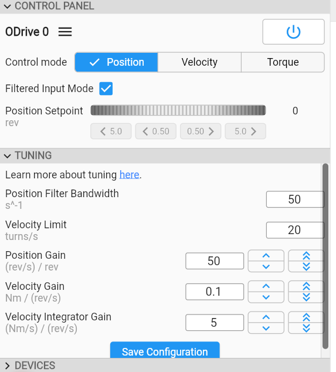

# 2026-04-13 — ODrive linear encoder integration

**Role(s):** engineering

**ODrive S1 linear encoder integration**

- Run odrv0.axis0.requested_stat = FULL_CALIBRATION_SEQUENCE to make sure the encoders are measuring in the same direction.

- Now the stage moves in the wrong direction, but we can fix that later.

- Tuning position controller with flexure fixed:

  - 

- Test step/dir from CNC controller

  - Works, but there is quite a lot of vibration from the velocity controller.

  - The vibration is less when disabling the linear encoder and just using the rotary encoder in the control loop

  - Probably, there are a lot more flexibilities in the loop with the fixed flexure

    - Clamping plate not fully touching

    - Preload screws have point contact

    - …

  - This in combination with a non-collocated control creates vibrations.
