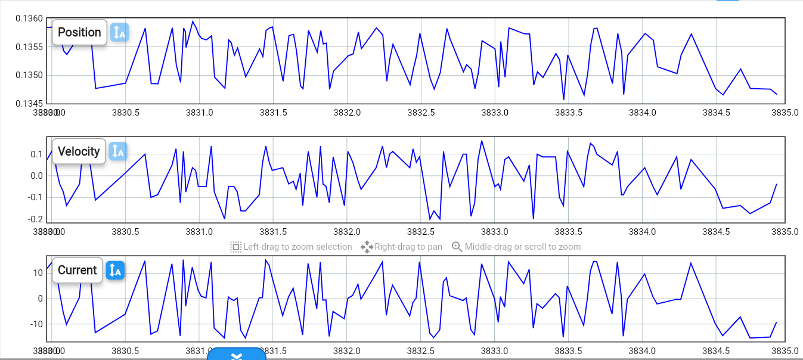

# 2026-04-15 — Meeting Joppe

**Role(s):** engineering

Meeting Joppe

- Agenda

  - Update Joppe

    - Model - acceleration srnsitivity

  - Update Niels

    - Linear encoder

  - Planning till end thesis

    - Deadline?

    - Goal

    - What is still needed?

    - Steps

  - Problems with setup

- Notes

**Torque sine wave with linear encoder**

Frequency 50Hz, 0.5Nm amplitude

Approximately 10 µm peak-to-peak motion of the stage.

**Tuning of controller with flexibility**

- Setting the velocity limit too low in torque mode causes the vibrations.
