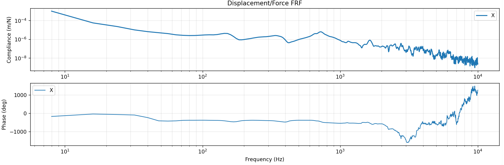
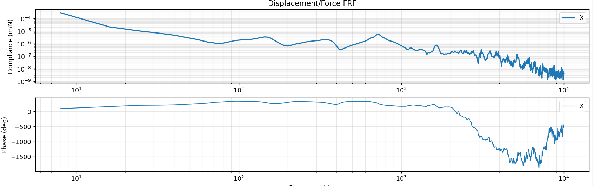
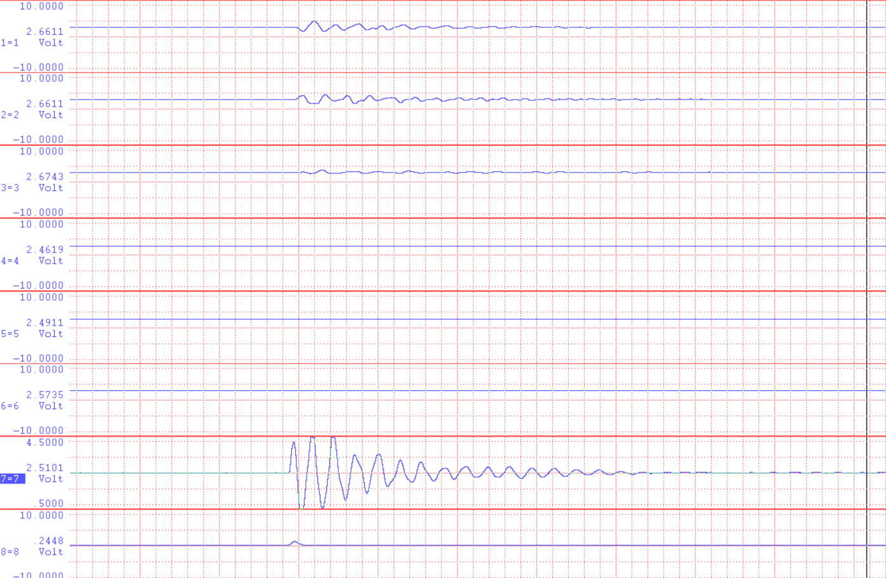
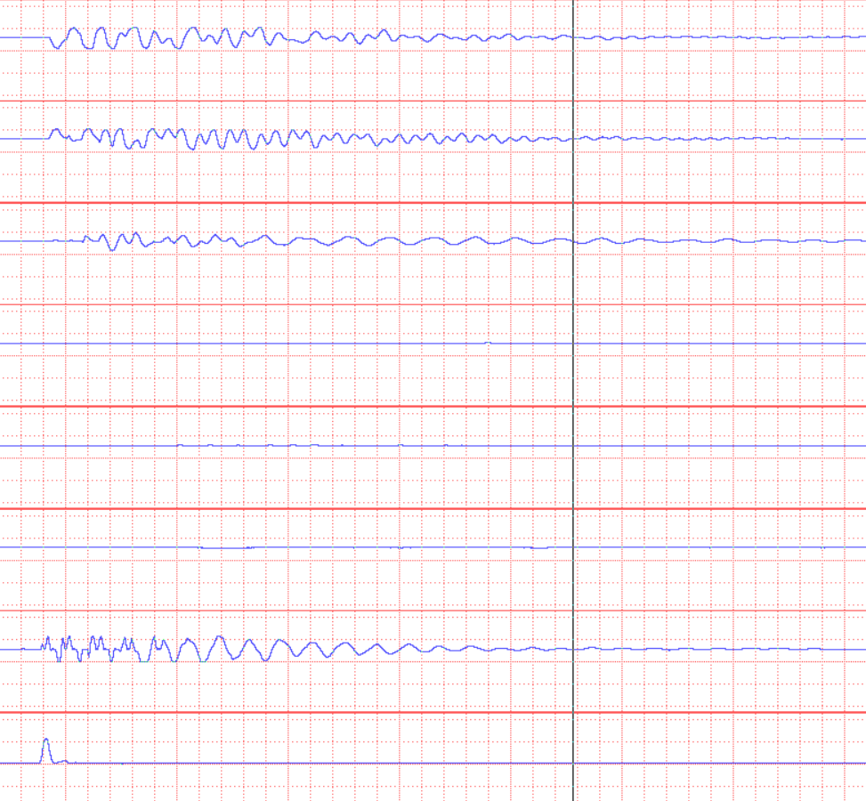

# 2026-04-24 — Tap test reciprocating motion

**Role(s):** engineering

- Tap test with reciprocating motion of the slide, flexible suspension, X315 Y315 Z60:

> 

- Why don’t we see a lot more flexibility?

  - Soft tap 

  - Hard tap\
    

  - The frequency is probably so low that we cannot see the acceleration.

  - Maybe this is why compliance goes up at low frequencies?

- How to test the difference in compliance between all the controllers then?
