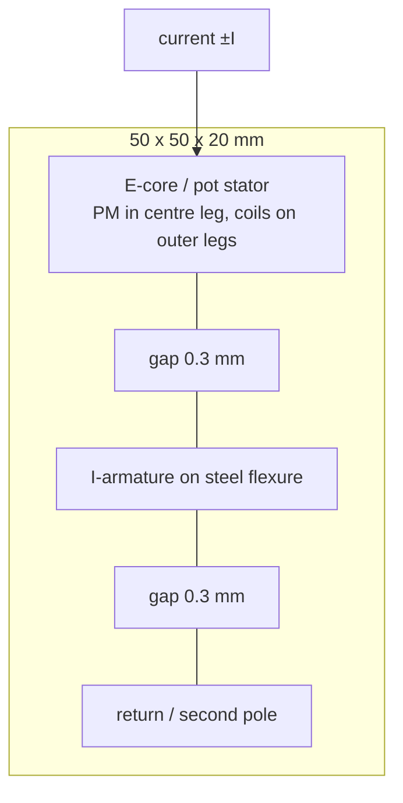
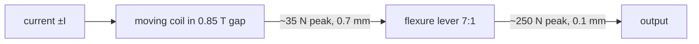

# short-stroke-actuator-concepts

First-order feasibility of three two-sided actuators that fit a **50 × 50 × 20 mm**
envelope, produce **> 200 N**, travel **> 0.1 mm**, and move with **> 10 Hz** bandwidth
at a **BOM below 100 EUR** (feedback sensor excluded — it will be provided).

**Tool:** Python 3, standard library only.

```bash
python3 simulation/cases/short-stroke-actuator-concepts/size_concepts.py
```

Results: [`simulation/results/short-stroke-actuator-concepts/summary.md`](../../results/short-stroke-actuator-concepts/summary.md).

This study sits at the start of the actuator design phase. CAD is still empty
([`cad/README.md`](../../../cad/README.md)). It continues the
[2026-08-24 reluctance investigation](../../../docs/log/2026-08-24_reluctance-actuator-investigation.md)
and uses the measured spindle stiffness of **100 N / 140 µm = 0.71 N/µm**
([2026-01-27](../../../docs/log/2026-01-27_machine-stiffness-measurement.md)).

## What the envelope actually allows

Power is not the problem. Peak mechanical power at 10 Hz, 0.1 mm peak-to-peak, 200 N is
about **1.3 W**. The constraints that bite are **force density**, **two-sidedness**, and
**thermal / reflected inertia**.

A reaction-mass (inertial) shaker in this box is the wrong mental model at 10 Hz:

| Frequency | Proof mass needed for 200 N at ±50 µm |
| --- | ---: |
| 10 Hz | ~1000 kg |
| 100 Hz | ~10 kg |
| 700 Hz (spindle mode in the [2026-05-07 FRF](../../../docs/log/2026-05-07_frf-and-compliance-measurements.md)) | ~0.21 kg |

The whole 50 × 50 × 20 mm envelope in steel is **0.39 kg**. So this device has to be a
**coupling actuator** between two machine parts (or a short-stroke stage), not a 10 Hz
proof-mass damper. At the 700 Hz spindle mode an inertial armature of ~0.2 kg would start
to make sense — that is a different operating point than the 10 Hz floor.

**6-DOF at 200 N per axis does not fit.** Magnetic pressure at 1.2 T is about 0.57 N/mm².
The 50 × 50 mm face is 2500 mm²; even if it were all pole face that is only ~1400 N of
total force budget, with no room for coils or return path. Six axes × 200 N = 1200 N is
already that entire budget. Realistic stretch: **z + rx + ry (piston / tip-tilt) at ~200 N
axial**, with much weaker x / y / rz.

## The three concepts

### 1. PM-biased differential reluctance + flexure guide

Solves the two problems left open on 2026-08-24: reluctance force of a few hundred
newtons is available, but a single gap only attracts.



A permanent magnet sets a bias field **B0 ≈ 0.8 T** in two opposing gaps. The coil adds
**±b ≈ 0.4 T**. Net force on the armature is

```text
F = 2 B0 b A / μ0
```

With **A = 20 × 20 mm** that is **204 N**, linear in current to first order, and
**two-sided**. Nominal gap 0.3 mm leaves **0.4 mm** of two-sided travel before a 0.10 mm
residual. Coil MMF is only ~100 At (100 turns at 1.4 A, about 3 W copper). Current-mode
drive at 24 V still has headroom at 100 Hz (`V_L ≈ 15 V`).

The flexure takes lateral loads and sets a well-defined gap; it must be much softer than
the machine so the 200 N goes into the structure. Against 0.71 N/µm and an 80 g armature
the mechanical resonance is **~480 Hz**.

**BOM (order-of-magnitude):** EI laminations or water-jet SiFe €10, magnet wire €5, N42
magnets €10, laser-cut spring-steel flexure €20, H-bridge €10, housing/fasteners €10.
**~€55.** Laminations (or ferrite, at the cost of lower Bsat) are required if the
actuator is later used near the 700 Hz spindle mode; at 10 Hz even solid iron would
mostly work.

**6-DOF stretch:** sector the stator into three 120° poles. The same puck then does
**z, rx, ry**. Rim poles for x/y/rz are possible but starve for area in 20 mm height —
expect tens of newtons, not 200 N.

**Main risks:** force ~ 1/gap² if the PM bias is uneven; eddy currents in solid iron;
the 20 mm stack-up (back iron + window + gap + armature + flexure) has only ~2 mm of
spare.

### 2. Flextensional multilayer piezo

A cheap 10 × 10 × 18 mm PZT stack gives ~**20 µm** free stroke and ~**3200 N** blocking.
A steel diamond / APA-style shell of amplification **6×** and ~60 % hinge efficiency
converts that to **~120 µm** travel and **~250 N** two-sided once the shell preloads the
stack and the drive is biased around mid-stroke (0–150 V around ~90 V).


This is the same topology as a Cedrat APA. The closest catalogue part that already fits
the box is the **APA40SM**: 54 µm, 260 N, 15 × 27 × 12 mm — force and envelope are
proven, stroke is about 2× short of 0.1 mm. A custom lower-amplification shell around a
taller stack closes that gap. Parts that do 0.1 mm and 200 N in the catalogue
(APA100M, APA120ML) are either 55 mm long or several thousand euros.

Mechanical resonance against the machine stiffness is **~390 Hz**. The piezo itself
resonates in the kilohertz. Lossy 150 V drive is ~0.5 W at 10 Hz and ~10 W at 200 Hz;
a recovering class-D stage is nicer but not required for the 10 Hz floor.

**BOM:** Chinese 10 × 10 × 18 mm stack €20–40 (PI-grade is €400 and blows the budget),
laser-cut stainless shell €20, DIY 150 V amplifier (boost + HV op-amp) €25–40.
**~€90**, with the driver as the item that can slip over €100.

**6-DOF stretch:** three stacks at 120° under a triangular platen give z/rx/ry. Three
flextensional shells do not sit comfortably in 50 × 50 mm; three bare 10 mm stacks would
fit in height but only deliver ~20 µm.

**Main risks:** stack tension (must stay preloaded under 200 N external load), hinge
fatigue, hysteresis/creep (the provided sensor closes that loop), HV safety, driver cost.

### 3. Lorentz voice coil + flexure lever

A Lorentz motor is naturally two-sided and linear, but **F = J V_cu B** in this volume
is only **~15 N continuous / ~35 N peak** of coil force. A **7:1** flexure lever brings
the output to **~250 N peak / ~100 N continuous**. Coil stroke is 0.7 mm, which still
fits a 1 mm airgap inside 20 mm.



Reflected coil mass is ~2.6 kg. Against 0.71 N/µm that is **~84 Hz** — enough for the
10 Hz spec with a 3× margin, not enough to sit under a 700 Hz spindle mode. Continuous
200 N is **not** available with natural cooling; this concept is a **short-duty / chatter
burst** actuator.

A **rotary BLDC + 50 µm eccentric** looks attractive on torque (only 10 mNm) and cost
(a 2207 motor is ~€15, and the project already has ODrive current loops). It fails
bandwidth: rotor inertia reflected through a 50 µm crank is ~**600 kg**, resonance
~**5 Hz**. A larger crank plus a second-stage lever does not remove the J / r² problem
unless the motor is a large-diameter pancake with r_out ≳ 1 mm and ~0.2 N·m — then the
package is the whole 50 mm and height is gone. Do not pick the rotary-eccentric shortcut
unless the 10 Hz floor is the actual operating frequency and inertia is modelled in FEA.

**BOM:** N52 magnets €20, coil €8, steel flexure lever €20, H-bridge or existing ODrive
€10, return iron €10. **~€70.**

**6-DOF stretch:** three or four coils under a flexure platen for z/rx/ry. Lateral
Lorentz channels have even less copper. Same 6-DOF budget problem as the others.

**Main risks:** thermal (200 N is peak-only), flexure lever compliance eating stroke,
84 Hz plant pole if anyone later wants mid-band chatter control.

## Comparison

| | Reluctance | Flextensional piezo | Lorentz + lever |
| --- | --- | --- | --- |
| Two-sided | yes, with PM bias + two gaps | yes, with preload + bias voltage | native |
| Force | 204 N (magnetic, continuous-ish) | ~250 N (preloaded) | 250 N peak / 100 N cont. |
| Travel | 0.4 mm in a 0.3 mm gap stack-up | 0.12 mm at 6× | 0.1 mm (coil 0.7 mm) |
| Plant resonance vs machine | ~480 Hz | ~390 Hz | ~84 Hz |
| BOM | ~€55 | ~€90, driver-sensitive | ~€70 |
| 6-DOF in-box | best path: 3-sector z/rx/ry | three shells do not fit | 3 coils for z/rx/ry |
| Why pick it | force density, cost, 6-DOF puck | bandwidth headroom, no magnetics | linearity, reuse of current-loop hardware |

## Rejected at this envelope

- **Bare voice coil (no lever):** ~30–70 N peak, not 200 N.
- **Rotary eccentric / cam without a large crank radius:** reflected inertia kills >10 Hz.
- **SMA wire:** 10 Hz is the cooling limit, hysteresis, poor for closed-loop force.
- **Pneumatic / hydraulic servo:** valve cost and seals blow the BOM; compressibility
  fights 10 Hz in a long line (a sealed hydrostatic lever might work, but not as a first
  prototype).
- **Terfenol-D / magnetostriction:** piezo-like stroke, magnet-like BOM, worse supply.
- **Off-the-shelf linear motors:** the [2026-04-21 supplier look](../../../docs/log/2026-04-21_linear-motor-suppliers.md)
  is a different size and cost class.

## Suggested first prototype

Build **concept 1** as a single-axis E-I puck with a flexure-guided armature, because it
is the only concept that offers 200 N without a thermal or HV-driver exception, and the
same iron can later be split into three sectors. Use the provided sensor from day one;
reluctance force is gap-dependent. Keep concept 2 as the high-bandwidth alternative if
the first plant pole has to sit well above 100 Hz. Keep concept 3 only if linearity and
existing ODrive current hardware outweigh the peak-duty thermal limit.
